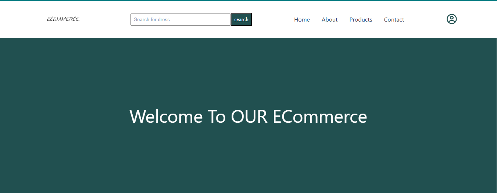
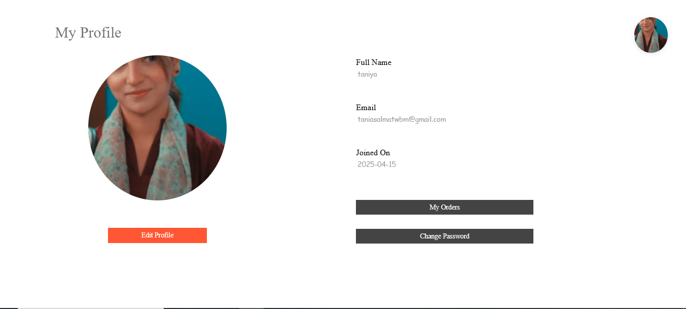
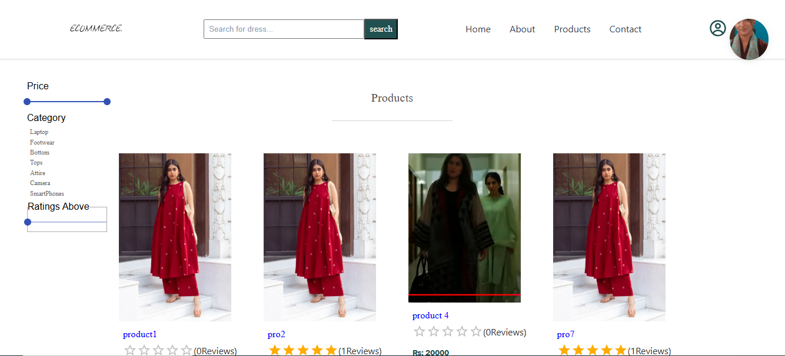
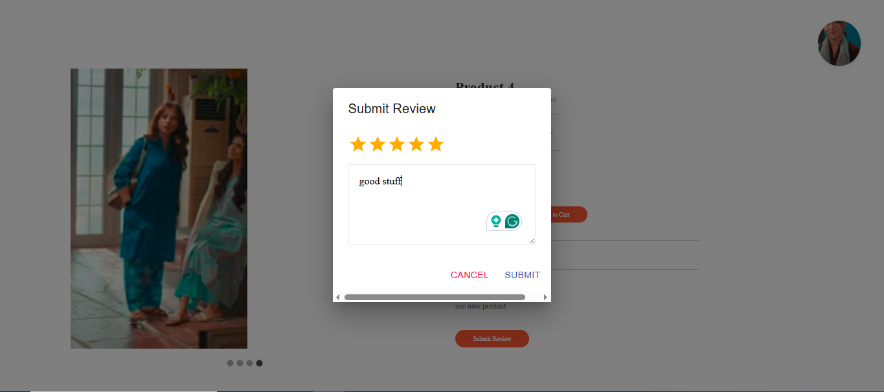
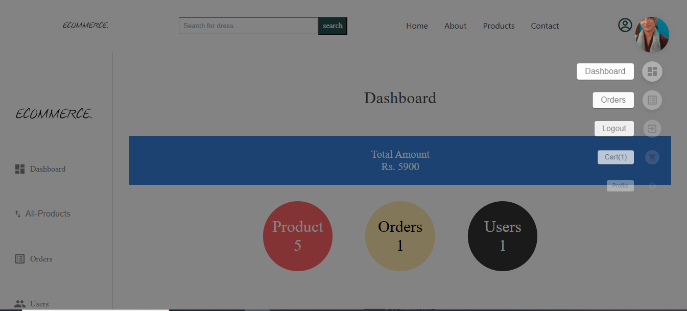
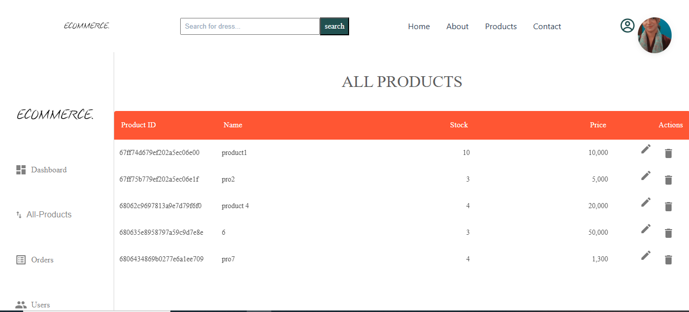
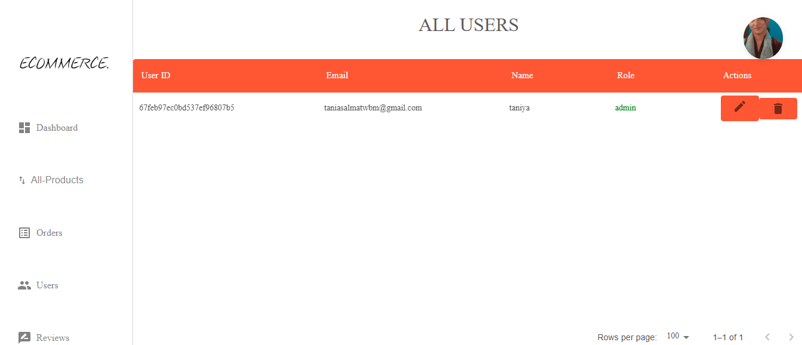

## <h1 align="center">🏪 E-Commerce Website</h1>

<p align="center">
  A fully functional e-commerce platform built using <strong>MERN Stack</strong> with modern UI/UX and secure authentication.
</p>

---

## 🚀 Features

✅ <strong>User Authentication</strong> (Login/Register with JWT)  
✅ <strong>Role-based Access</strong> (Admin/User)  
✅ <strong>Product Management</strong> (Listing, Search, Filters)  
✅ <strong>Shopping Cart & Checkout</strong>  
✅ <strong>Payment Integration</strong> (Stripe)  
✅ <strong>Admin Panel</strong> (Product & Order Management)  
✅ <strong>Responsive UI</strong> (Mobile-friendly design)  

---

## 🛠 Tech Stack

<table>
  <tr>
    <td><strong>Frontend</strong></td>
    <td>React.js, Redux Toolkit, TailwindCSS</td>
  </tr>
  <tr>
    <td><strong>Backend</strong></td>
    <td>Node.js, Express.js</td>
  </tr>
  <tr>
    <td><strong>Database</strong></td>
    <td>MongoDB, Mongoose</td>
  </tr>
  <tr>
    <td><strong>Authentication</strong></td>
    <td>JWT (JSON Web Token)</td>
  </tr>
  <tr>
    <td><strong>Payment</strong></td>
    <td>Stripe</td>
  </tr>
  <tr>
    <td><strong>Hosting</strong></td>
    <td>null</td>
    
  </tr>
</table>

---

## 📦 Installation & Setup

```bash
# Clone the repository
git clone https://github.com/yourusername/ecommerce-project.git

# Navigate to the project folder
cd ecommerce-project

# Install dependencies
npm install

# Start the development server
npm run dev
```

---

## 📽️ Project Demo

Click below to watch the project demo video:

👉 [Watch Demo Video](https://drive.google.com/file/d/1XTsPPbKmAhnC5ImMAxrtgZAL9Rfp5Buy/view)

Or use the direct download link:  
[Download Video](https://drive.google.com/uc?export=download&id=1XTsPPbKmAhnC5ImMAxrtgZAL9Rfp5Buy)


---

## 📸 Screenshots

### Home Page









<p align="center">

  <!-- 
  <br> -->
  <em>Screenshot of the Ecommerece Project </em>
</p>

## 💡 Why This Project?

This project demonstrates real-world **e-commerce functionalities** and is structured following industry best practices.


✅ **Clean Code** | ✅ **Scalable Architecture** | ✅ **Modern UI**

---

## 🔗 Connect with Me

📧 taniasalamat2@gmail.com   

---

### 🎯 **Give a Star ⭐ if you like this project!**

